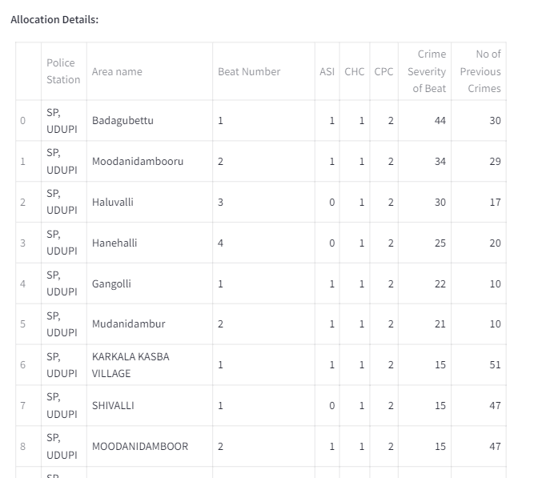

# Predictive Guardians: Empowering Law Enforcement with AI-Driven Crime Prevention 🚔💻

**Deployed Application: [Predictive Guardians Web App](https://predictive-guardians.streamlit.app/)**

# Table of Contents 📜
1. Introduction 🌟
2. Crime Pattern Analysis 🔍
    * Temporal Analysis 🕰️
    * Spatial Analysis 🗺️
    * Cluster Analysis 🔗
3. Criminal Profiling 👨‍🏫
    * Demographic Analysis 👥
    * Offense Category Analysis 📊
4. Predictive Modeling 🔮
    * Recidivism Prediction 🔁
    * Crime Type Prediction 🔍
    * Crime Hotspot Prediction 🔥
5. Police Resource Allocation 🔒
    * User Input 🙋‍♂️
    * Resource Allocation 🎯
6. Continuous Learning and Feedback 💻🔍
    * Police Resource Allocation 🔒
    * Provide Feedback 📝
    * Knowledge Base 📚
    * Feedback Sessions 🤝
    * Alert Monitoring 🔔
7. Conclusion 🌏

# Introduction 🌟
In today's world, where crime patterns are often reactive rather than proactive, law enforcement agencies face a daunting challenge in optimizing their resources and strategies. 🤔 However, the tide is turning, and the future of crime prevention is here with Predictive Guardians - an innovative, AI-powered solution that is set to revolutionize the way we approach public safety. 🚨

Predictive Guardians utilises advanced data analysis and machine learning to uncover the hidden patterns and trends in criminal activities. 🔍 By leveraging a comprehensive suite of analytical tools, our solution empowers law enforcement agencies to make data-driven decisions, enabling them to allocate their resources more efficiently and effectively. 💼

From spatial analysis to criminal profiling, and from predictive modeling to resource allocation, Predictive Guardians is a one-stop-shop for proactive crime prevention. 🗺️ Through a seamless integration of cutting-edge technologies, my platform provides law enforcement agencies with the insights and actionable intelligence they need to stay one step ahead of the criminals. 🕵️‍♀️

Join me on this transformative journey as we redefine the future of public safety and ensure that our communities are safe, secure, and resilient. 🌍 With Predictive Guardians at your fingertips, the path to a safer tomorrow is within reach. 🚀

# Crime Pattern Analysis 🔍
The Crime Pattern Analysis component of our solution focuses on understanding the spatial, temporal, and cluster-based patterns of crime data. By utlising advanced data visualization and analysis techniques, we empower law enforcement agencies to uncover hidden insights and trends, ultimately enabling more informed and effective decision-making. 📊

## Temporal Analysis 🕰️
The Temporal Analysis module allows users to analyse the temporal trends of crime incidents, uncovering patterns and seasonality in the occurrence of specific crime types. Through interactive charts and visualizations, users can analyze the distribution of crimes over time (by year, month, or day), identifying key insights that can guide resource allocation and preventive strategies. 📅

## Spatial Analysis 🗺️
The Spatial Analysis component provides a comprehensive view of the geographic distribution of crimes, enabling the identification of high-risk areas and crime hotspots. By utlilising powerful mapping tools and geospatial techniques, our solution highlights the relationships between crime locations and other relevant factors, such as demographic and socioeconomic data. This invaluable information empowers law enforcement agencies to deploy resources more effectively and implement targeted crime prevention measures. 🌍

## Cluster Analysis 🔗
The Cluster Analysis component takes a deep dive into the underlying patterns and associations within crime data. By grouping similar crime incidents based on factors like location, time, crime type, and offender characteristics, our solution uncovers emerging or shifting crime trends that might otherwise be overlooked. This powerful feature enables law enforcement agencies to stay one step ahead of the criminals, anticipating and addressing emerging threats proactively. 🕵️‍♀️

Throughout the Crime Pattern Analysis component, we have seamlessly integrated interactive visualizations and intuitive user interfaces to ensure a seamless and engaging experience for our users. 🖥️ Whether you're a seasoned crime analyst or a policymaker seeking to drive change, Predictive Guardians' Crime Pattern Analysis tools will provide you with the insights and decision support you need to build safer and more resilient communities. 🌇

# Criminal Profiling 🕵️‍♀️
The Criminal Profiling component of our solution provides deep insights into the characteristics and behavioral patterns of offenders, enabling law enforcement agencies to develop more targeted and effective crime prevention strategies. 📊

## Demographic Analysis 👥
Through thorough analysis of the age, gender, and caste distribution of criminals, our platform gives insights on the demographic factors associated with different types of criminal activities. 📊 This information can inform resource allocation, community engagement, and intervention programs tailored to specific high-risk populations.

For instance, the Age Distribution chart provides a visual representation of the age range of criminals, allowing stakeholders to identify potential age-related trends and design age-appropriate rehabilitation programs. 📈 Similarly, the Gender Analysis pie chart highlights the gender-based patterns, which can guide the development of gender-specific crime prevention initiatives. 🚺🚹

## Offense Category Analysis 📊
In addition to demographic insights, the Criminal Profiling component explores into the offense categories and sub-categories associated with criminal behavior. By analyzing the top crime groups and their corresponding sub-categories, our solution empowers law enforcement to understand the underlying drivers and dynamics of different types of crimes. 🔍

The bar charts showcasing the Top 5 Most Frequent Crime Group Categories and the Top 5 Crime Groups Sub-Categories provide a clear and concise overview of the criminal landscape, enabling data-driven decision-making and the prioritization of resources. 📊

Through the seamless integration of interactive visualizations and comprehensive data analysis, the Criminal Profiling component of Predictive Guardians equips law enforcement agencies with the insights they need to develop more effective crime prevention strategies, address root causes, and build safer communities. 🌇 By understanding the profiles and patterns of offenders, we can take proactive steps to interrupt the cycle of crime and promote lasting change. 🚀

# Predictive Modeling 🔮
The Predictive Modeling component of our solution utilises advanced machine learning and data mining techniques to forecast future crime trends and patterns, empowering law enforcement agencies to stay one step ahead of the criminals. 🕵️‍♀️

## Recidivism Prediction 🔁
The Recidivism Prediction module aims to identify individuals with a high likelihood of committing repeat crimes, enabling targeted interventions and rehabilitation programs. 🌟 By analyzing factors such as age, caste, profession, and criminal history, our model provides accurate predictions to help law enforcement agencies allocate resources more effectively and break the cycle of crime. 📊

## Crime Type Prediction 🔍
The Crime Type Prediction component utilises historical data and location-based features to forecast the occurrence of specific crime types in a given area. 🗺️ This invaluable information allows law enforcement agencies to proactively deploy resources, implement targeted prevention strategies, and stay ahead of emerging threats. 💡

## Crime Hotspot Prediction 🔥
The Crime Hotspot Prediction module takes a deep dive into the spatial patterns of criminal activities, identifying areas with a high likelihood of future crime incidents. 🌇 By integrating advanced clustering algorithms and interactive mapping tools, our solution highlights the concentration of various crime types, enabling the strategic deployment of police resources and the implementation of preventative measures. 🚨

Throughout the Predictive Modeling component, we have integrated user-friendly interfaces and intuitive visualizations, making it easy for law enforcement agencies to access and interpret the insights generated by our advanced models. 💻 Whether you're a data analyst or a decision-maker, Predictive Guardians' Predictive Modeling tools will provide you with the foresight and decision support you need to build safer and more resilient communities. 🌍

# Police Resource Allocation 🔒
The Police Resource Allocation component of our solution provides a powerful optimization-based approach to the strategic deployment of police personnel, ensuring that law enforcement resources are utilized in the most efficient and effective manner. 📊

## User Input 🙋‍♂️
To begin the resource allocation process, users are prompted to select the specific unit or geographical area of interest. 🗺️ This allows our platform to tailor the optimization algorithms and recommendations to the unique characteristics and crime patterns of the selected region.

## Resource Allocation 🎯
At the heart of the Police Resource Allocation component lies a complex optimization model, which takes into account a variety of factors, including the number of available police officers (by rank), the severity and frequency of past crimes, and the unique characteristics of each beat or patrol area. 🧠

All the available police resources data were taken from [this source](https://ksp.karnataka.gov.in/page/Administration/K+S+P+Strength/en).

Using advanced mathematical programming techniques, our solution determines the optimal distribution of ASI (Assistant Sub-Inspectors), CHC (Head Constables), and CPC (Police Constables) officers across the specified beats, ensuring that high-risk areas receive the necessary resources and that the overall police force is deployed in a balanced and coordinated manner. 🚨

The output of the optimization process is presented in a clear and intuitive tabular format, allowing law enforcement agencies to visualize the recommended allocation of personnel and understand the rationale behind the decisions. 📊 This transparent approach empowers stakeholders to make informed decisions, promote accountability, and continuously refine the resource allocation strategies based on evolving needs and feedback.

By integrating the Police Resource Allocation component into the Predictive Guardians platform, we enable law enforcement agencies to take a proactive and data-driven approach to public safety, ensuring that the right resources are in the right place at the right time. 🚔 This holistic solution helps to reduce response times, optimize patrol coverage, and ultimately, create safer and more resilient communities. 🌇

# Continuous Learning and Feedback 💻🔍
Predictive Guardians places a strong focus on continuous learning and feedback, ensuring that the system remains responsive to the evolving needs of law enforcement agencies and the communities they serve. 🌟

## Police Resource Allocation 🔒
The Continuous Learning and Feedback component includes the Police Resource Allocation feature, which enables law enforcement agencies to update the allocation of their personnel resources based on the insights and feedback gathered through the system. 💼

Users can easily select the specific unit or geographical area they want to update, view the current resource allocation, and input new values for the number of ASI (Assistant Sub-Inspectors), CHC (Head Constables), and CPC (Police Constables) officers. 🚔

## Provide Feedback 📝
Users of the Predictive Guardians platform are encouraged to provide feedback on the accuracy, usefulness, and overall performance of the system's various components. This feedback is collected through a user-friendly interface, allowing stakeholders to rate the system's outputs and share their valuable insights. 💬

## Knowledge Base 📚
The feedback data collected is continuously analyzed and synthesized, forming a comprehensive knowledge base that captures the lessons learned and best practices identified throughout the system's deployment. This knowledge base serves as a valuable resource for continuous improvement and informs future development and optimization efforts. 🧠

## Feedback Sessions 🤝
To advance collaborative learning and ongoing system refinement, Predictive Guardians promotes regular feedback sessions, bringing together law enforcement agencies, community stakeholders, and domain experts. These sessions provide a platform for open dialogue, shared experiences, and the co-creation of innovative solutions to address emerging challenges. 🙌

## Alert Monitoring 🔔
Predictive Guardians includes a robust alert monitoring system that continuously tracks the system's performance and user feedback. When pre-defined thresholds are approached or exceeded, the platform automatically triggers email alerts to the technical team, prompting immediate investigation and response. This proactive approach ensures that any issues or user concerns are addressed in a timely manner, maintaining the system's reliability and user trust. 📢

By integrating the principles of continuous learning and feedback, Predictive Guardians ensures that the solution remains at the forefront of crime prevention technology, continuously adapting and improving to better serve the needs of law enforcement agencies and the communities they protect. 🌍 This commitment to iterative development and user-centric design is a hallmark of our platform, ensuring that Predictive Guardians remains a trusted and invaluable partner in the fight against crime. 🚀

# Conclusion 🌏
As we reach the end of our journey with Predictive Guardians, we are filled with a sense of optimism and a renewed determination to transform the landscape of public safety. 🌟  

Through the seamless integration of advanced data analysis, predictive modeling, and intelligent resource allocation, Predictive Guardians empowers law enforcement agencies to make data-driven decisions, predict emerging threats, and deploy their personnel and resources with laser-sharp precision. 📊 By utilizing the power of AI and cutting-edge technologies, we have created a platform that not only reacts to crime patterns but proactively shapes the future of public safety. 🚀

From spatial and temporal analysis to criminal profiling and predictive modeling, each component of Predictive Guardians has been carefully designed to provide law enforcement agencies with the insights and actionable intelligence they need to stay one step ahead of the criminals. 🕵️‍♀️ Whether it's identifying high-risk areas, forecasting crime trends, or optimizing resource allocation, our solution empowers stakeholders to allocate their resources more effectively, implement targeted prevention strategies, and build safer, more resilient communities. 🌇

As we look towards the future, I am are excited to continue my collaboration with law enforcement agencies, policymakers, and community leaders, working tirelessly to transform the way we approach public safety. 🤝 By embracing the power of data-driven decision-making and the latest advancements in AI and analytics, I am confident that Predictive Guardians will play a major role in the fight against crime, guiding in a new era of proactive and efficient law enforcement. 🚔

Join me on this transformative journey to redefine the future of public safety and create a world where everyone can live, work, and thrive without the constant threat of crime. 🌍 With Predictive Guardians as your trusted partner, the path to a safer tomorrow is within reach. 🚦

