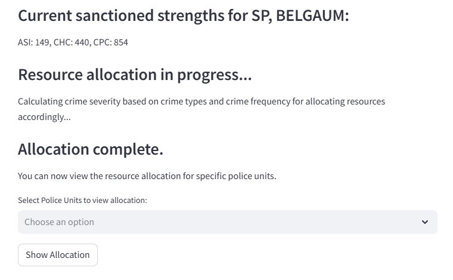

# Predictive Guardians: Empowering Law Enforcement with AI-Driven Crime Prevention 🚔💻

**Deployed Application: [Predictive Guardians Web App](https://predictive-guardians.streamlit.app/)**


# Table of Contents 📜
1. [Introduction 🌟](#introduction)
2. [Crime Pattern Analysis 🔍](#crime-pattern-analysis)
    * [Temporal Analysis 🕰️](#temporal-analysis)
    * [Spatial Analysis 🗺️](#spatial-analysis)
    * [Crime Hotspots 🚨](#crime-hotspots)
3. [Criminal Profiling 👨‍🏫](#criminal-profiling)
    * [Demographic Analysis 👥](#demographic-analysis)
    * [Offense Category Analysis 📊](#offense-category-analysis)
4. [Predictive Modeling 🔮](#predictive-modeling)
    * [Repeat Offense Prediction 🔁](#recidivism-prediction)
5. [Police Resource Allocation 🔒](#police-resource-allocation)
    * [User Input 🙋‍♂️](#user-input)
    * [Allocation Algorithm🎯](#allocation-algorithm)
6. [Continuous Learning and Feedback 💻🔍](#continuous-learning-and-feedback)
    * [Police Resource Allocation 🔒](#police-resource-allocation-1)
    * [Provide Feedback 📝](#provide-feedback)
    * [Knowledge Base 📚](#knowledge-base)
    * [Feedback Sessions 🤝](#feedback-sessions)
    * [Alert Monitoring 🔔](#alert-monitoring)

7. [Necessary Installations](#necessary-installations) 🛠️
8. [Running the Project](#running-the-project) 🚀
9. [Conclusion 🌏](#conclusion)


<a id="introduction"></a>
# Introduction 🌟
In today's world, where crime patterns are often reactive rather than proactive, law enforcement agencies face a daunting challenge in optimizing their resources and strategies. 🤔 However, the tide is turning, and the future of crime prevention is here with Predictive Guardians - an innovative, AI-powered solution that is set to revolutionize the way we approach public safety. 🚨

Predictive Guardians utilises advanced data analysis and machine learning to uncover the hidden patterns and trends in criminal activities. 🔍 By integrating a comprehensive suite of analytical tools, my solution empowers law enforcement agencies to make data-driven decisions, enabling them to allocate their resources more efficiently and effectively. 💼

From spatial analysis to criminal profiling, and from predictive modeling to resource allocation, Predictive Guardians is a one-stop solution for proactive crime prevention. 🗺️ My platform provides law enforcement agencies with the insights and actionable intelligence they need to stay one step ahead of the criminals. 🕵️‍♀️


<a id="crime-pattern-analysis"></a>
# Crime Pattern Analysis 🔍
The Crime Pattern Analysis component of my solution focuses on understanding the spatial, temporal, and cluster-based patterns of crime data. By utlising advanced data visualization and analysis techniques, it empowers law enforcement agencies to uncover hidden insights and trends, ultimately enabling more informed and effective decision-making. 📊

<a id="temporal-analysis"></a>
## Temporal Analysis 🕰️
The Temporal Analysis module allows users to analyse the temporal trends of crime incidents, uncovering patterns and seasonality in the occurrence of specific crime types. Through interactive charts and visualizations, users can analyze the distribution of crimes over time (by year, month, or day), identifying key insights that can guide resource allocation and preventive strategies. 📅


<a id="spatial-analysis"></a>
## Spatial Analysis 🗺️
The Spatial Analysis component is a dynamic geospatial visualization tool that transforms crime data into an informative, color-coded district map 🗺️. By allowing users to select between crime incidents, victim counts, and accused counts, it provides a nuanced view of crime distribution across different districts 🚨. This interactive feature enables law enforcement and policymakers to quickly identify crime patterns and allocate resources strategically 🛡️.


<a id="crime-hotspots"></a>
## Crime Hotspots 🚨
The Crime Hotspots component is a geospatial analysis tool that transforms complex crime data into an intuitive, interactive map 🗺️. By enabling dynamic filtering of crime types and date ranges, it provides law enforcement and community leaders with real-time insights into crime patterns, helping them visualize high-density crime areas through color-coded heatmaps and strategic markers 🚨. This feature turns raw data into a proactive safety strategy, empowering users to understand and respond to emerging crime trends 🛡️.


<a id="criminal-profiling"></a>
# Criminal Profiling 🕵️‍♀️
The Criminal Profiling component of my solution provides deep insights into the characteristics and behavioral patterns of offenders, enabling law enforcement agencies to develop more targeted and effective crime prevention strategies. 📊

<a id="demographic-analysis"></a>
## Demographic Analysis 👥
Through thorough analysis of the age, gender, and caste distribution of criminals, my platform gives insights on the demographic factors associated with different types of criminal activities. 📊 This information can inform resource allocation, community engagement, and intervention programs tailored to specific high-risk populations.

For instance, the Age Distribution chart provides a visual representation of the age range of criminals, allowing stakeholders to identify potential age-related trends and design age-appropriate rehabilitation programs. 📈 Similarly, the Gender Analysis pie chart highlights the gender-based patterns, which can guide the development of gender-specific crime prevention initiatives. 🚺🚹


<a id="offense-category-analysis"></a>
## Offense Category Analysis 📊
In addition to demographic insights, the Criminal Profiling component includes the offense categories and sub-categories associated with criminal behavior. By analyzing the top crime groups and their corresponding sub-categories, my solution empowers law enforcement to understand the underlying drivers and dynamics of different types of crimes. 🔍

The bar charts showcasing the Top 5 Most Frequent Crime Group Categories and the Top 5 Crime Groups Sub-Categories provide a clear and concise overview of the criminal landscape, enabling data-driven decision-making and the prioritization of resources. 📊


<a id="predictive-modeling"></a>
# Predictive Modeling 🔮
The Predictive Modeling component of my solution utilises machine learning and data mining techniques to forecast future crime trends and patterns, empowering law enforcement agencies to stay one step ahead of the criminals. 🕵️‍♀️

<a id="recidivism-prediction"></a>
## Repeat Offense Prediction 🔁
The repeat offense prediction module aims to identify individuals with a high likelihood of committing repeat crimes, enabling targeted interventions and rehabilitation programs. 🌟 By analyzing factors such as age, caste, profession, and criminal history, my model provides accurate predictions to help law enforcement agencies allocate resources more effectively and break the cycle of crime. 📊


<a id="police-resource-allocation"></a>
# Police Resource Allocation 🔒
The Police Resource Allocation component of my solution is designed to optimize the allocation of police personnel across districts and beats based on crime severity and sanctioned strengths. It includes optimization techniques to ensure efficient resource distribution. 📊

<a id="user-input"></a>
## User Input 🙋‍♂️
To begin the resource allocation process, users are prompted to select the specific district. 🗺️ Choose between **default** and **customizable** sanctioned strengths for ASIs, CHCs, and CPCs. Default includes automatically populated based on the district’s predefined sanctioned strengths for:
  - **Assistant Sub-Inspectors (ASI)**
  - **Head Constables (CHC)**
  - **Police Constables (CPC)**

Default values ensure a quick start without manual adjustment.
You can customise values within a predefined range for flexibility.
All the available police resources data were taken from this official source: https://ksp.karnataka.gov.in/page/Administration/K+S+P+Strength/en


## Allocation Algorithm 🤖
<a id="allocation-algorithm"></a>
The resource allocation is powered by a linear programming optimization algorithm with the following key steps:

**Objective**:
  - Maximize the weighted sum of normalized crime severity and allocated resources.

**Constraints**:
  - Ensure the total allocated personnel do not exceed the sanctioned strengths.
  - Guarantee each beat is assigned at least one officer.
  - Proportionally allocate resources based on normalized crime severity.
  - It also considers the factors such as the number of available police officers (by rank), the severity and frequency of past crimes, and the unique characteristics of each beat or patrol area.


The output of the optimization process is presented in a clear and intuitive tabular format with filter option to select the police units in the respective district to view allocation. 📊 




<a id="continuous-learning-and-feedback"></a>
# Continuous Learning and Feedback 💻🔍
Predictive Guardians places a strong focus on continuous learning and feedback, ensuring that the system remains responsive to the evolving needs of law enforcement agencies and the communities they serve. 🌟


<a id="police-resource-allocation-1"></a>
## Police Resource Allocation 🔒
The Continuous Learning and Feedback component includes the Police Resource Allocation feature, which enables law enforcement agencies to update the allocation of their personnel resources based on the insights and feedback gathered through the system. 💼

Users can easily select the specific unit or geographical area they want to update, view the current resource allocation, and input new values for the number of ASI (Assistant Sub-Inspectors), CHC (Head Constables), and CPC (Police Constables) officers. 🚔


<a id="provide-feedback"></a>
## Provide Feedback 📝
Users of the Predictive Guardians platform are encouraged to provide feedback on the accuracy, usefulness, and overall performance of the system's various components. This feedback is collected through a user-friendly interface, allowing stakeholders to rate the system's outputs and share their valuable insights. 💬


<a id="knowledge-base"></a>
## Knowledge Base 📚
The feedback data collected is continuously analyzed and synthesized, forming a comprehensive knowledge base that captures the lessons learned and best practices identified throughout the system's deployment. This knowledge base serves as a valuable resource for continuous improvement and informs future development and optimization efforts. 🧠


<a id="feedback-sessions"></a>
## Feedback Sessions 🤝
To advance collaborative learning and ongoing system refinement, Predictive Guardians promotes regular feedback sessions, bringing together law enforcement agencies, community stakeholders, and domain experts. These sessions provide a platform for open dialogue, shared experiences, and the co-creation of innovative solutions to address emerging challenges. 🙌


<a id="alert-monitoring"></a>
## Alert Monitoring 🔔
Predictive Guardians includes a robust alert monitoring system that continuously tracks the system's performance and user feedback. When pre-defined thresholds are approached or exceeded, the platform automatically triggers email alerts to the technical team, prompting immediate investigation and response. This proactive approach ensures that any issues or user concerns are addressed in a timely manner, maintaining the system's reliability and user trust. 📢


<a id="necessary-installations"></a>
# Necessary Installations 🛠️

To ensure the smooth functioning of this project, several installations are required:

1. Clone this repository to your local machine.

    ```bash
    git clone https://github.com/VishalKumar-S/Predictive_Guardians.git
    ```
  
2. Navigate to the Project Directory:
    ```bash
    cd Predictive_Guardians
    ```

3. Install the necessary Python packages.

    ```bash
    pip install -r requirements.txt
    ```


<a id="running-the-project"></a>
# Running the Project 🚀
Follow these steps to run the streamlit app:


   - Navigate to the Project Directory:
  ```bash
   cd Predictive_Guardians
   ```

   - Navigate to the app Directory:
  ```bash
   cd app
   ```

   - Run the Streamlit Application:
  ```bash
   streamlit run app.py
   ```


<a id="conclusion"></a>
# Conclusion 🌟

Predictive Guardians is more than just a tool—it's a transformative approach to modern law enforcement. By integrating AI-driven insights, my solution empowers police forces to predict, prevent, and respond to crime more effectively than ever before. 🚔💡 From uncovering crime patterns to optimizing resource allocation, my platform bridges the gap between data and action, ensuring safer communities and smarter policing. 🌟

With continuous learning and feedback at its core, Predictive Guardians evolves alongside the needs of its users, promoting collaboration and innovation. Together, we can build a future where crime is not just reacted to, but foreseen and prevented. 🌍🛡️

Let’s step into a safer tomorrow—one prediction at a time. 🔮✨


